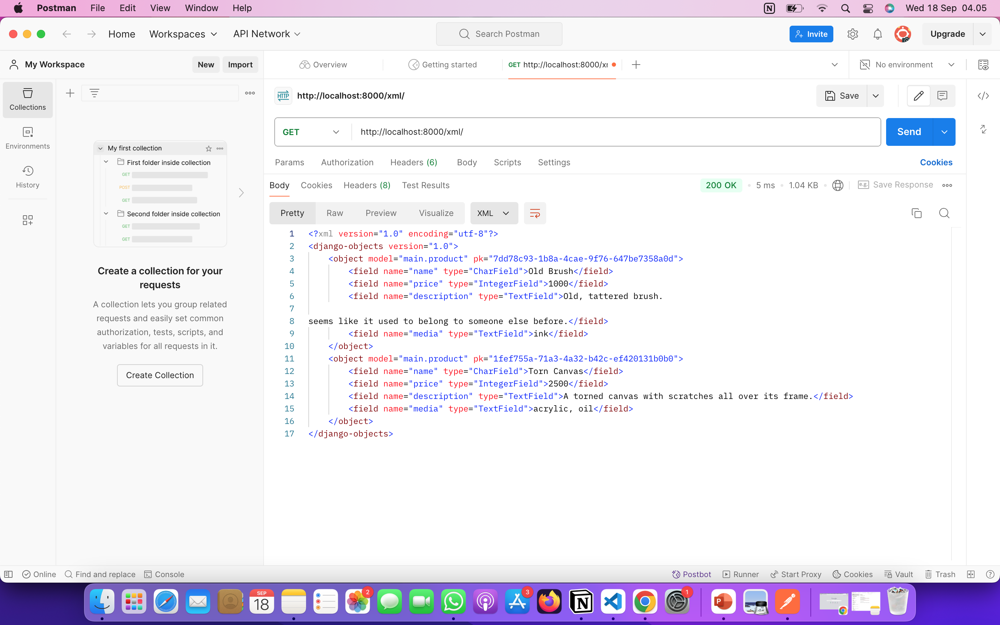
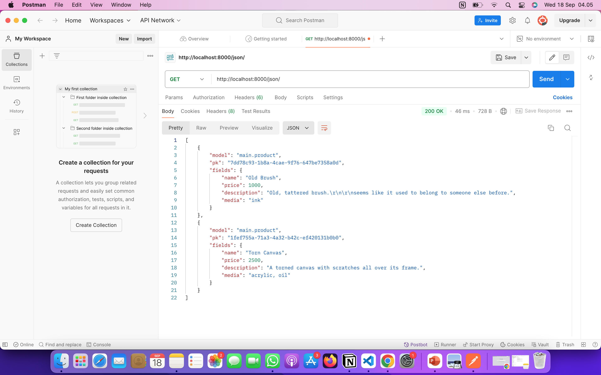
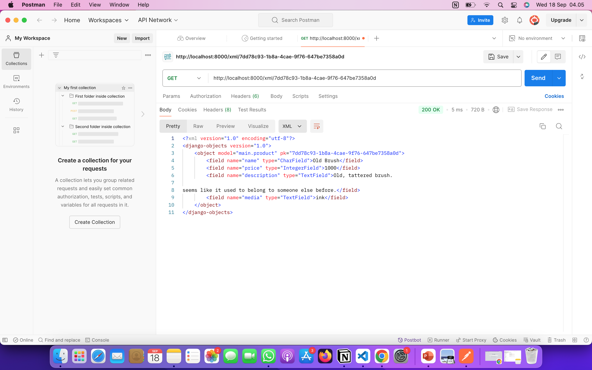
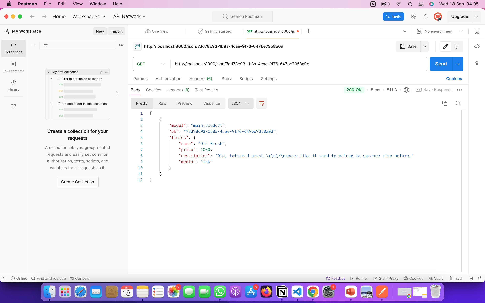
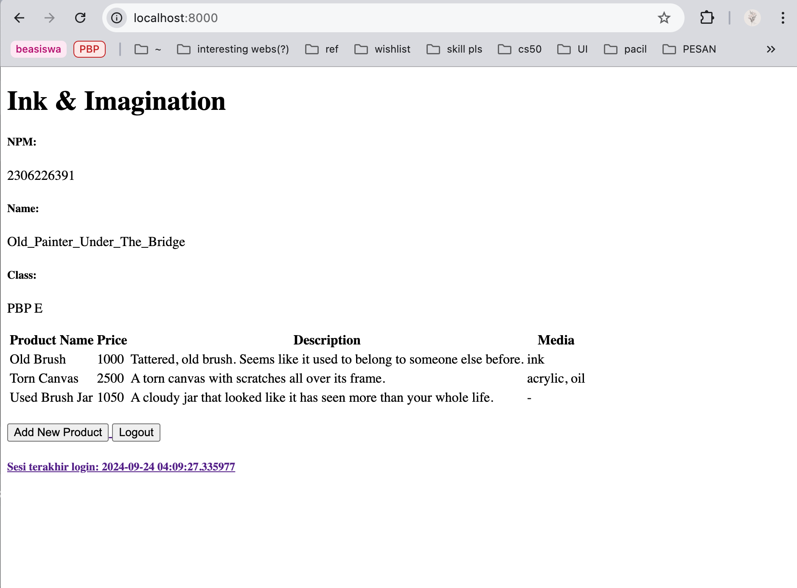
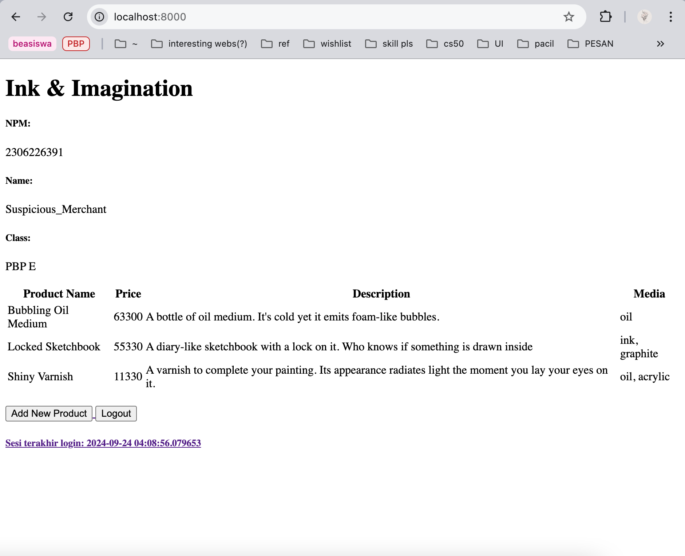
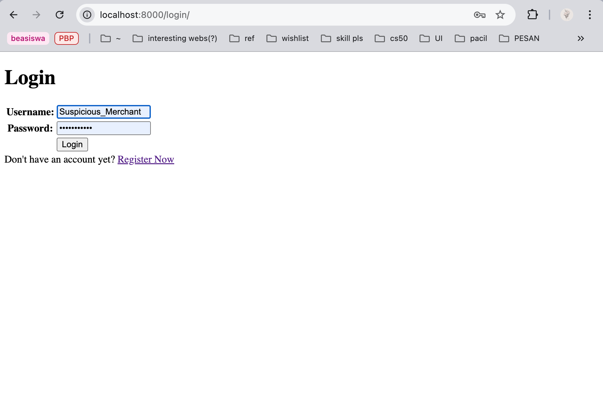

Nama: Nafisa Arrasyida
NPM: 2306226391
Kelas: PBP E

Link PWS: http://nafisa-arrasyida-inkandimagination.pbp.cs.ui.ac.id/

Jawaban Tugas 2
1. Jelaskan bagaimana cara kamu mengimplementasikan *checklist* di atas secara *step-by-step* (bukan hanya sekadar mengikuti tutorial). 
    - Pertama, dengan membuat proyek django, yang dilakukan dengan mengaktifkan environment, lalu membuat serta mendownload dependencies dalam berkas requirements.txt dan memulai project. 
    - Checklist yang kedua dan ketiga adalah membuat aplikasi main dan melakukan routing agar app tersebut bisa dijalankan, yang dilakukan dengan memulai app bernama main, dan mendaftarkan aplikasi tersebut ke dalam proyek dalam installed apps agar bisa dijalankan. 
    - Checklist yang selanjutnya adalah dengan membuat models pada app main, yang berisi suatu class 'Product' dengan beberapa atribut wajib. Ini dilakukan dengan mendaftarkan class Product dalam berkas models.py dalam direktori aplikasi main, beserta atribut-atribut yang diperlukan.
    - Selanjutnya adalah membuat fungsi dalam views.py yang mengembalikan nama app, juga nama dan kelas saya. Dalam berkas views.py pada main, saya membuat fungsi show_main untuk kemudian ditampilkan pada template html. dalam context saya mengisi nama aplikasi, nama saya, npm, dan kelas saya, lalu direturn ke 'main.html' jika ada request.
    - Setelah itu, saya melakukan routing URL dengan mengonfigurasi routing pada aplikasi main, dengan menambahkan fungsi show_main pada berkas urls.py dalam direktori main, dan mengonfigurasi routing proyek dengan menginclude main.urls pada berkas urls.py di direktori proyek.
    - Kemudian adalah checklist untuk deployment ke PWS. Saya melakukan deployment dengan membuat project baru di website PWS, menambahkan URL deployment pada allowed hosts, lalu mengikuti perintah deployment.
    - Checklist yang terakhir adalah mengisi Readme.md, dengan menjawab pertanyaan dan mencantumkan tautan aplikasi PWS.

2. Buatlah bagan yang berisi *request client* ke web aplikasi berbasis Django beserta responnya dan jelaskan pada bagan tersebut kaitan antara `urls.py`, `views.py`, `models.py`, dan berkas `html`.

                                  http request                                    ________
       ____               ______               ____              ____            | Model  | (models.py)
     /      \           /        \           /      \          /      \   <----> |________|
    |  User  |  ---->  | Browser  |  ---->  |  URLS  |  ----> |  View  |          __________
     \      /           \        /           \      /          \      /   <----> | Template | (berkas .html)
       ----               ------               ----              ----            |__________|
                                             (urls.py)        (views.py)
                                                                   |
                                                                   V
                                                             http request

3. Jelaskan fungsi `git` dalam pengembangan perangkat lunak!
    git digunakan sebagai version control, yang bermanfaat untuk melacak dan megontrol perubahan versi kode dan untuk merging ataupun branching yang membantu kolaborasi antara developer.
    
4. Menurut Anda, dari semua framework yang ada, mengapa framework Django dijadikan permulaan pembelajaran pengembangan perangkat lunak?
    Menurut saya framework ini dipilih karena adanya MVT yang sangat membantu dalam mempelajari website development, terutama karena MVT memiliki struktur dan konsep yang jelas, sehingga pemula bisa mempelajari bagaimana sebuah aplikasi web bekerja secara terorganisir, terutama dalam pemisahan pekerjaan setiap bagian dari MVT. Selain itu, django juga memiliki banyak fitur bawaan yang memudahkan pemula untuk memahami konsep arsitektur web secara menyeluruh tanpa harus repot membuat semuanya dari nol.
    
5. Mengapa model pada Django disebut sebagai *ORM*?
    Model disebut ORM (Object-Relational Mapping) pada django karena model merupakan penghubung antara basis data dengan objek.

===========================================================================

Jawaban Tugas 3
1. Jelaskan mengapa kita memerlukan *data delivery* dalam pengimplementasian sebuah platform?
Data delivery diperlukan untuk bertukar data dari suatu komponen ke komponen lainnya. Biasanya suatu platform memiliki beberapa komponen, data delivery membuat komponen-komponen tersebut bisa bertukar data dengan benar dan efektif.

2. Menurutmu, mana yang lebih baik antara XML dan JSON? Mengapa JSON lebih populer dibandingkan XML?
Saya lebih memilih json karena formatnya lebih ringkas, rapi, dan mudah dipahami. JSON lebih populer kemungkinan karena strukturnya tersebut dan kecepatan kinerjanya yang lebih baik daripada XML.

3. Jelaskan fungsi dari method `is_valid()` pada form Django dan mengapa kita membutuhkan method tersebut?
Method is_valid() dibutuhkan untuk memastikan semua yang masuk pada form sudah sesuai dan tidak ada masalah, agar pada tahap proses selanjutnya tidak ada kemungkinan eror yang muncul akibat isian form yang tidak valid.

4. Mengapa kita membutuhkan `csrf_token` saat membuat form di Django? Apa yang dapat terjadi jika kita tidak menambahkan `csrf_token` pada form Django? Bagaimana hal tersebut dapat dimanfaatkan oleh penyerang?
CSRF atau cross-site request forgery adalah bentuk serangan yang seolah-olah membuat pengguna merequest sesuatu pada website tanpa diketahuinya. csrf_token bermanfaat untuk memastikan request tersebut benar-benar dari pengguna yang sah. Jika tidak memakai csrf_token, penyerang akan dapat mengirim request atas nama pengguna tanpa sepengetahuan mereka.

5. Jelaskan bagaimana cara kamu mengimplementasikan *checklist* di atas secara *step-by-step* (bukan hanya sekadar mengikuti tutorial).
- Checklist yang pertama adalah membuat form input untuk menambahkan objek model yang ada pada app, yaitu untuk menambahkan product. Dimulai dengan berkas baru dalam main, yang berisi class form tersebut, berisi dengan model dan fields yang akan ditanyakan pada form. Setelah itu membuat fungsi untuk  menampilkan form membuat product yang menerima request pada berkas views.py di main. Dalam berkas tersebut saya juga mengubah method show_main agar menampilkan form tersebut pada halaman utama. Setelah itu saya mengimport dan menambahkan path url form tersebut. Selanjutnya saya membuat berkas html untuk mengatur tampilan halaman form tersebut. Pada halaman main, saya menambahkan tombol untuk redirect ke halaman form untuk menambah produk dan tabel yang akan menampilkan daftar produk yang ada. Terakhir, saya melihat hasilnya di localhost:8000 setelah menjalankan server
- Checklist yang kedua adalah menambahkan 4 fungsi untuk melihat objek dalam format XML dan JSON, dengan filter id dan tidak. Fungsi-fungsi ini ditambahkan pada berkas views.py dalam direktori main. Pada berkas tersebut saya menambahkan import HttpResponse dan serializers lalu membuat fungsi show_xml, show_json, show_xml_by_id, dan show_json_by_id. masing-masing berisikan data semua objek product dan mereturn sebuah HttpResponse.
- Checklist yang ketiga adalah membuat routing URL untuk masing-masing views. routing tersebut saya lakukan pada berkas urls.py di main, dengan menambahkan import show_xml, show_json, show_xml_by_id, dan show_json_by_id, lalu menambahkan path ke fungsi masing-masing views pada urlpatterns. Kemudian saya mengecek hasilnya dengan membuka localhost:8000/xml ataupun json, diikuti dan tidak diikuti id produk setelah menjalankan server.
- Checklist berikutnya adalah mengisi readme dan menjawab pertanyaan-pertanyaan yang jawabannya bisa dilihat disini.
- Checklist berikutnya adalah mengakses keempat url views di poin 2 dengan postman, berikut saya cantumkan screenshotnya: 

    Screenshot Postman
    - XML view
    

    - JSON view
    

    - XML by id
    

    - JSON by id
    

===========================================================================

Jawaban Tugas 4

1. Apa itu Django `UserCreationForm`, dan jelaskan apa kelebihan dan kekurangannya?
UserCreationForm adalah impor formulir bawaan yang memudahkan pembuatan formulir pendaftaran pengguna dalam aplikasi web. UserCreationForm memiliki beberapa kelebihan, seperti penggunaannya yang mudah sehingga tidak perlu menulis kode dari awal, aman, dan dapat disesuaikan dengan keinginan. Kekurangannya, UserCreationForm hanya menyediakan field username dan password, penampilan defaultnya kurang menarik, dan validasi bawaannya hanya untuk kata sandi dan terbatas

2. Apa perbedaan antara autentikasi dan otorisasi dalam konteks Django, dan mengapa keduanya penting?
Autentikasi adalah proses mengidentifikasi identitas pengguna, sementara otorisasi adalah proses pemberian izin oleh pihak yang memilikinya. Keduanya penting terutama untuk kontrol akses dan keamanan, agar data dan fitur hanya dapat diakses pengguna yang sah.

3. Apa itu *cookies* dalam konteks aplikasi web, dan bagaimana Django menggunakan *cookies* untuk mengelola data sesi pengguna?
Cookies adalah kumpulan data yang disimpan di perangkat user ketika mengunjungi suatu website. Django menggunakan cookies untuk mengelola sesi pengguna dengan menyimpan id sesi tersebut pada cookies. Session ID ini kemudian dipetakan ke suatu struktur data pada sisi web server. Dengan demikian, data sesi bisa tersimpan di cookies tanpa menyimpan informasi-informasi pengguna, ini lebih aman dan 'tepat' untuk cookies yang memiliki kapasitas kecil.

4. Apakah penggunaan *cookies* aman secara *default* dalam pengembangan web, atau apakah ada risiko potensial yang harus diwaspadai?
Cookie itu sendiri tidak menyebabkan risiko, tetapi jika digunakan dengan tidak benar cookie bisa menimbulkan risiko keamanan. Cookie dapat menyimpan informasi sensitif yang bisa rentan terhadap akses tidak sah jika tidak dilindungi dengan baik. Cookies juga rentan terhadap Serangan Cross-Site Scripting (XSS), dimana penyerang menyisipkan kode berbahaya ke suatu situs dan mendapatkan cookies pengguna yang masuk ke situs tersebut. Selain itu, cookies juga dapat dimanfaatkan untuk serangan CSRF.

5. Jelaskan bagaimana cara kamu mengimplementasikan *checklist* di atas secara *step-by-step* (bukan hanya sekadar mengikuti tutorial).
- Checklist yang pertama adalah mengimplementasikan fungsi registrasi, login, dan logout untuk memungkinkan pengguna untuk mengakses aplikasi sebelumnya dengan lancar. 
    - Mengimplementasikan fungsi registrasi dan membuat form registrasi
    Setelah mengaktifkan virtual environment, saya mengimport UserCreationForm dan menambahkan fungsi untuk registrasi pada views.py dalam subdirektori main. Setelah menambahkan fungsi registrasi di views, saya menambahkan template html untuk form registrasi tersebut. Selanjutnya, saya mengonfigurasi routing fungsi ini pada urls.py, dimana saya mengimport nama fungsi tersebut lalu menambahkan pathnya di urlpatterns.
    - Mengimplementasikan fungsi login
    Setelah fungsi registrasi, saya membuat fungsi login dengan langkah yang relatif sama. Saya menambahkan beberapa import lagi di views.py, yaitu authenticate, login, dan AuthenticationForm. Setelahnya saya menambahkan fungsi login itu sendiri pada berkas tersebut, yang jika valid akan meneruskan ke main dan jika tidak akan tetap di halaman login. Kemudian saya membuat template html dan mengonfigurasi routing fungsi login_user dalam urls.py dengan mengimport dan menambahkan pathnya dalam urlpatterns.
    - Mengimplementasikan fungsi logout
    Saya memulai membuat fungsi logout dengan mengimport logout pada views.py, kemudian membuat implementasi fungsi logout tersebut yang meredirect ke halaman login. selanjutnya saya memasukkan tombol logout pada main.html. kemudian seperti 2 fungsi lainnya, saya mengonfihurasi routing fungsi logout di urls.py dengan mengimport logout_user dan menambahkan path fungsi tersebut ke urlpatterns.

- Checklist yang kedua adalah membuat dua akun pengguna dengan masing-masing tiga dummy data menggunakan model yang telah dibuat pada aplikasi sebelumnya untuk setiap akun di lokal. Setelah mengimplementasikan checklist pertama dan merestriksi halaman main, saya meregistrasikan 2 akun dalam aplikasi saya. Saya kemudian menghubungkan model `Product` dengan `User` sebelum menambahkan product pada masing-masing akun. Setelahnya masing-masing akun sebagai penjual login kembali, lalu mendaftarkan 3 produk yang mereka tawarkan. Berikut saya cantumkan screenshotnya:
    - Akun pertama:
    
    
    - Akun kedua:
    
    

- Menghubungkan model `Product` dengan `User`.
Menghubungkan model Product pada User dilakukan dengan mengimport model User lalu menghubungkannnya dengan Product dengan cara menambahkan baris kode: user = models.ForeignKey(User, on_delete=models.CASCADE) ke dalam kode model Product. Setelah itu, saya mengubah fungsi create_product_entry pada views.py dengan tambahan commit=False dalam form.save dan menetapkan request.user sebagai user pada objek model product tersebut. Selanjutnya, saya mengubah context pada show_main agar menampilkan nama user yang saat itu sedang login dengan request.user.username dan menyimpan semua perubahan yang saya buat. Setelah itu saya melakukan migration dan menetapkan user pertama sebagai user objek-objek model product yang sebelumnya ada, dengan memilih no. 1 saat muncul error dalam migrasi model. Setelah melakukan migration, saya mempersiapkan aplikasi saya untuk environtment production dengan mengimport os pada settings.py dan mengganti variabel debug.

- Menampilkan detail informasi pengguna yang sedang *logged in* seperti *username* dan menerapkan `cookies` seperti `last login` pada halaman utama aplikasi.
    - Menampilkan username user yang sedang login
    Saya melakukan checklist yang ini bersamaan dengan checklist sebelumnya, dimana saya mengimport model User. Menampilkan nama user cukup sederhana, yaitu dengan menambahkan data user pada fungsi show_main dalam views.py, yaitu dengan menambahkan key user pada context dengan value request.user.username. Saya juga menambahkan user pada main.html agar ditampilkan di halaman main pada aplikasi.
    - Menerapkan `last login`
    Menerapkan data last login dilakukan dengan menggunakan data dari cookies. Saya memulai dengan menambahkan import HttpResponseRedirect, reverse, dan datetime pada views.py dalam main. Setelah itu, saya sedikit mengubah fungsi login_user dengan menambahkan cookie yang bernama last_login untuk melihat kapan terakhir kali pengguna melakukan login. Hal itu saya lakukan dengan mengganti kode yang ada pada blok if form.is_valid() dan menambahkan last_login sebagai request.COOKIES['last_login'] pada show_main di views.py. Kemudian saya mengubah fungsi logout_user dengan menambahkan response.delete_cookie('last_login') untuk menghapus cookie saat pengguna logout. Terakhir, saya menambahkan kalimat sesi terakhir login dan datanya pada main.html untuk menampilkannya pada halaman main.

- Untuk dua checklist terakhir, saya melengkapi README.md lalu melakukan add, commit, dan push ke github.